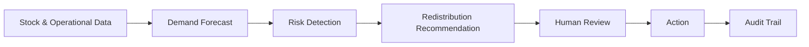
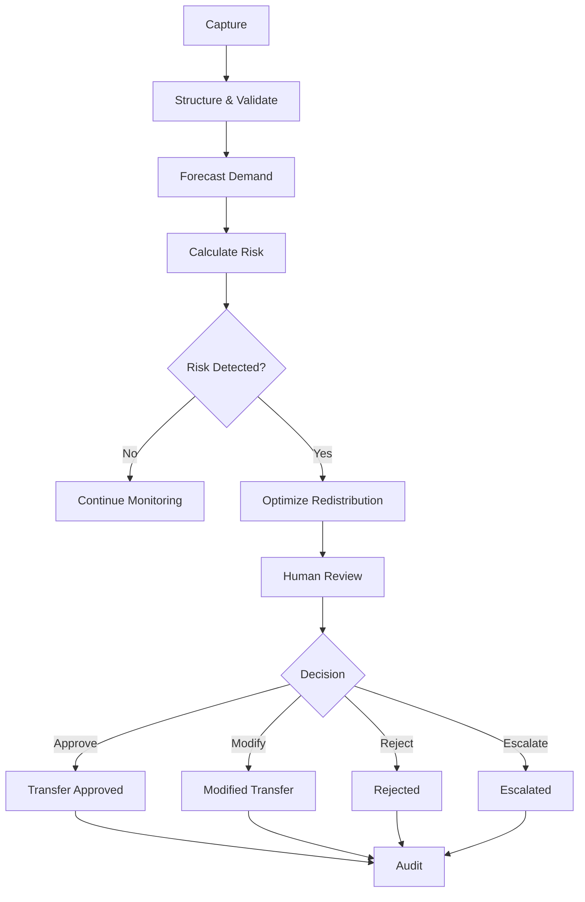
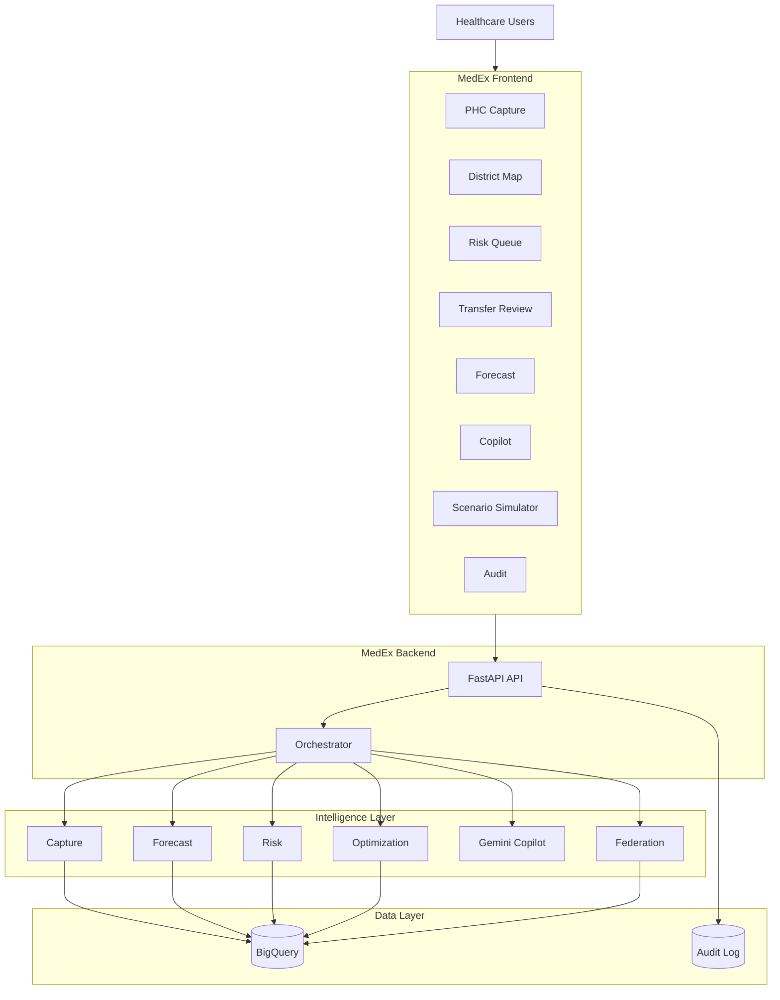
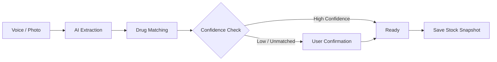
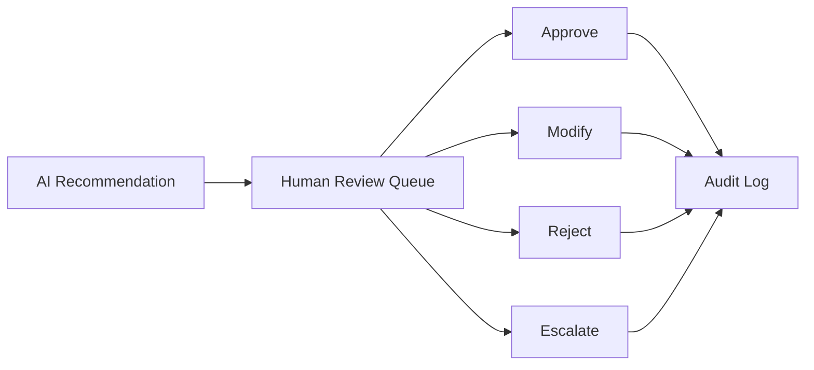
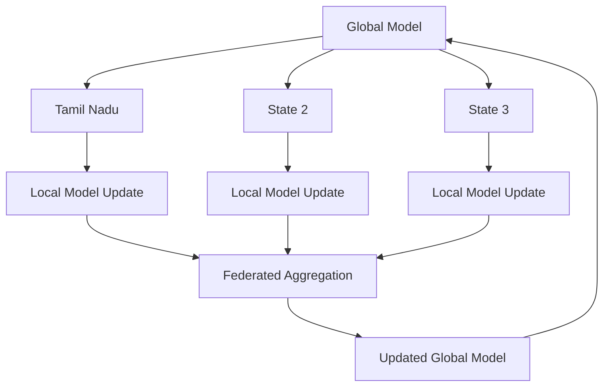

# MedEx

## Smart Health Supply Chain Resilience Platform

> **Predict shortages. Optimize supply. Enable faster, evidence-based decisions.**

MedEx is a federated AI-powered platform for improving healthcare supply-chain resilience. It provides visibility into medicine availability, forecasts demand, identifies stock-out risks, recommends redistribution, and keeps humans in control of operational decisions.

The prototype demonstrates the complete journey from **data capture to prediction, risk detection, redistribution, human approval, and audit**.

---

## 1. Problem

Healthcare facilities often depend on delayed reporting, manual records, and disconnected systems. This makes it difficult to identify shortages early or move available stock from one facility to another.

MedEx connects the major stages of the supply chain into a single decision-support workflow.



---

## 2. What MedEx Provides

| Capability          | Purpose                                                         |
| ------------------- | --------------------------------------------------------------- |
| Stock Capture       | Capture stock through voice, photo, or structured input         |
| Demand Forecasting  | Predict medicine demand with confidence ranges                  |
| Risk Detection      | Identify facilities approaching stock-out                       |
| Redistribution      | Recommend feasible medicine transfers                           |
| Gemini Copilot      | Query and explain approved operational data                     |
| Scenario Simulation | Test demand-shock scenarios                                     |
| Federated Learning  | Demonstrate cross-state model learning without raw-data sharing |
| Human Review        | Approve, modify, reject, or escalate recommendations            |
| Audit Trail         | Maintain traceability of important decisions                    |

---

## 3. How MedEx Works



The core principle is:

> **AI recommends. Humans decide.**

---

## 4. System Architecture



---

## 5. Intelligence Pipeline

### Capture

Voice and photo inputs are converted into structured stock information.



Low-confidence or unmatched capture rows require confirmation before being saved.

### Forecast

MedEx generates demand forecasts with P10, P50 and P90 ranges.

```text
Historical Demand
       +
Seasonality
       +
Operational Signals
       +
Weather / Disease Signals
       |
       v
Forecast Model
       |
   +---+---+
   |   |   |
  P10 P50 P90
```

### Risk

Risk considers stock availability, forecast demand, lead time, drug criticality, population served, vulnerability and emergency conditions.

```text
Usable Stock
     |
     v
Forecast Daily Demand
     |
     v
Days of Cover
     |
     +----> Stock-out Probability
     |
     +----> Priority Score
     |
     v
Red / Amber / Green
```

---

## 6. Redistribution

When a facility is at risk, MedEx evaluates potential donors and generates ranked transfer proposals.

```mermaid
flowchart LR
    A[At-Risk Facility]
    --> B[Find Donors]

    B --> C[Check Safety Buffer]
    C --> D[Check Quantity]
    D --> E[Check Expiry]
    E --> F[Check Capacity]
    F --> G[Check Travel Time]

    G --> H[OR-Tools Optimization]
    H --> I[Ranked Proposals]
    I --> J[Human Review]
```



The optimization considers transport cost/delay, unmet demand priority, donor safety buffer, vehicle capacity, expiry and accessibility constraints.

---

## 7. Human-in-the-Loop Governance

MedEx does not automatically execute redistribution decisions.



Every important decision is recorded for accountability and traceability.

---

## 8. Federated Learning

The prototype demonstrates learning across simulated state nodes without pooling raw state datasets.



The prototype simulates three state nodes. Production deployment would use stronger state-level isolation and secure aggregation.

---

## 9. User Roles

| Role     | Scope            |
| -------- | ---------------- |
| Facility | Own facility     |
| Block    | Own block        |
| District | Own district     |
| State    | State-wide       |
| Auditor  | Read-only access |

The API uses:

```http
X-Role
X-District
X-User
```

Backend row-level filtering enforces the permitted scope.

---

## 10. Application Modules

```text
MedEx
 |
 +-- PHC Capture
 +-- District Map
 +-- Risk Queue
 +-- Transfer Review
 +-- Forecast View
 +-- Federation Console
 +-- Gemini Copilot
 +-- Scenario Simulator
 +-- Audit Trail
```

These modules correspond to the core prototype screens defined in the product requirements.

---

## 11. API

Base path:

```text
/api/v1
```

Key endpoints:

| Function           | Endpoint                        |
| ------------------ | ------------------------------- |
| Health             | `GET /health`                   |
| Voice Capture      | `POST /capture/voice`           |
| Photo Capture      | `POST /capture/photo`           |
| Confirm Capture    | `POST /capture/confirm`         |
| Facilities         | `GET /facilities`               |
| Facility Status    | `GET /facilities/{id}/status`   |
| Forecast           | `GET /forecast`                 |
| Risk               | `GET /risk`                     |
| Optimize           | `POST /optimize`                |
| Transfers          | `GET /transfers`                |
| Transfer Decision  | `POST /transfers/{id}/decision` |
| Copilot            | `POST /copilot/ask`             |
| Scenario           | `POST /scenario/run`            |
| Federation         | `POST /federation/round`        |
| Federation History | `GET /federation/rounds`        |
| Audit              | `GET /audit`                    |

The OpenAPI contract is the integration source of truth.

---

## 12. Technology Stack

```text
Frontend       React / Next.js
UI             Tailwind
Backend        FastAPI
AI             Gemini
ML             Vertex AI / BigQuery ML
Data           BigQuery
Optimization   OR-Tools
Maps           Google Maps Platform
Voice          Speech-to-Text / Text-to-Speech
Translation    Google Cloud Translation
Deployment     Cloud Run
```

---

## 13. Prototype Scope

The primary prototype flow is:

```text
Capture
  ↓
Forecast
  ↓
Risk
  ↓
Redistribution
  ↓
Human Approval
  ↓
Explain
  ↓
Audit
```

Prototype target:

**3 simulated states, approximately 60 PHCs, and 25 essential drugs.**

P0 focuses on the core operational workflow. Scenario simulation, multilingual alerts and anomaly detection form the next prototype layer, while later integrations are treated as roadmap/design scope.

---

## 14. Key Principles

1. **AI assists decision-making; humans retain control.**
2. **Operational numbers come from structured data and models.**
3. **Gemini explains, extracts and translates; it does not fabricate stock figures.**
4. **Low-confidence capture requires confirmation.**
5. **Every important operational decision is auditable.**
6. **Federated learning avoids requiring raw cross-state training data.**
7. **The PRD and OpenAPI contract define the required prototype behavior.**

---

## 15. Source of Truth

MedEx implementation is based on:

* `openapi.yaml` — API contract and integration behavior
* `AushadhiGrid_PRD__Smart_Health___Supply_Chain_Resilience.html` — product requirements and architecture

## Together, these define the functional scope, API behavior, roles, workflows, AI components and prototype boundaries.

## MedEx

**Predict early. Identify risk. Recommend action. Keep humans in control.**

